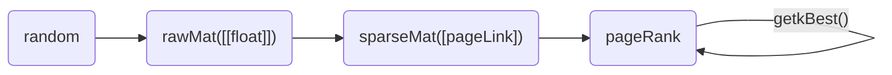

# PageRank

## 类型定义

```go
type rawMat struct{
    mat [][]float
}

type pageLink struct{
    src int
    deg int
    dests []int
}

type blockPageLink struct{
    pageLinks []pageLink
}

type sparseMat struct{
    pageLinks []blockPageLink
}

type pageRank struct{
    transferMat sparseMat
    oldRank []float
    newRank []float
}
```



## 数据生成

在实际生成数据时，不适用rawMat，而是直接在sparseMat中一边生成列数据，一边转成pageLink，否则巨大的rawMat会导致OOM，即使我们有足够的内存，我们在遍历rawMat生成sparseMat的时候，也会需要至少N^2的遍历次数，极其缓慢

目前，我们首先生成了原始的未分块的sparseMat，然后将其转换成分块的sparseMat，这需要至少N^2/block的遍历次数（这里block指一个block所含的page数) ，依旧缓慢，等待更新

## 序列化

在分块的设计中，我们应该一次从文件中读取一块，目前用内存模拟

在序列化设计中，要考虑block是不定长的，dests是不定长的，这两个都要在前面加长度字段

## Metric

集成了常见的三种范数

```python
class metric(object):
    @staticmethod
    def get1Norm(a: []):
        return sum(map(abs, a))

    @staticmethod
    def get2Norm(a: []):
        return math.sqrt(sum(map(lambda x: x**2, a)))

    @staticmethod
    def getInfNorm(a: []):
        return max(map(abs, a))
```

