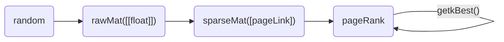

# PageRank

## 类型定义

```go
type rawMat struct{
    mat [][]float
}

type pageLink struct{
    src int
    deg int
    dests []int
}

type blockPageLink struct{
    pageLinks []pageLink
}

type sparseMat struct{
    pageLinks []blockPageLink
}

type pageRank struct{
    transferMat sparseMat
    oldRank []float
    newRank []float
}
```



## 数据生成

在实际生成数据时，不适用rawMat，而是直接在sparseMat中一边生成列数据，一边转成pageLink，否则巨大的rawMat会导致OOM，即使我们有足够的内存，我们在遍历rawMat生成sparseMat的时候，也会需要至少N^2的遍历次数，极其缓慢

一种朴素的想法是首先生成原始的未分块的sparseMat，然后将其转换成分块的sparseMat，这需要至少N^2*outDegree/block的遍历次数（这里block指一个block所含的page数),在实践上,这很慢

目前我们采用直接生成分块的sparseMat,速度上大幅提升

## 幂迭代
基于`block-strip`的幂迭代算法:  
```python
sparseMat = sparseMatGen.sparseMat(N, block)
pr = powerIter.pageRank(sparseMat, beta, block)
```  
基于block-based的幂迭代算法
```python
sparseMat = sparseMatGen.sparseMat(N, 1)
pr = powerIter.pageRank(sparseMat, beta, block)
```
不分块的幂迭代算法
```python
sparseMat = sparseMatGen.sparseMat(N, 1)
pr = powerIter.pageRank(sparseMat, beta, 1)
```

基于block-strip的测试代码:
```python
sparseMat = sparseMatGen.sparseMat(N, block)
pr = powerIter.pageRank(sparseMat, beta, block)

cnt = 0
loss = 0.
beg = time.time()

while (True):
    cnt += 1
    pr.iter(block)
    ok, loss = pr.isConvergence(epsilon, norm)
    print(f"\033[1;36miter:{cnt} loss:{loss}\033[0m")
    if ok:
        break

end = time.time()
```

```sh
[Time] function GenBlockPageLinks               done, elapsed: 11.288015604019165s
[Time] function iterBlock                       done, elapsed: 1.4938631057739258s
[Time] function iter                            done, elapsed: 1.4938631057739258s
[Time] function isConvergence                   done, elapsed: 0.029286861419677734s
iter:1 loss:0.2051479146187183
[Time] function iterBlock                       done, elapsed: 1.5120673179626465s
[Time] function iter                            done, elapsed: 1.5120673179626465s
[Time] function isConvergence                   done, elapsed: 0.026860952377319336s
iter:2 loss:0.05188872172406834
[Time] function iterBlock                       done, elapsed: 1.5165603160858154s
[Time] function iter                            done, elapsed: 1.5175974369049072s
[Time] function isConvergence                   done, elapsed: 0.023964405059814453s
iter:3 loss:0.01331470528623809
[Time] function iterBlock                       done, elapsed: 1.4943392276763916s
[Time] function iter                            done, elapsed: 1.4943392276763916s
[Time] function isConvergence                   done, elapsed: 0.027005672454833984s
iter:4 loss:0.003420038875911453
[done] iter:4 , loss=0.003420038875911453 , time:6.128960132598877s 
[Time] function getkBest                        done, elapsed: 0.0189969539642334s
=*=*=*=*=*=*=*=*=*=*=*=*=*=*=*=*=*=*=*=*
version:block-strip norm:get1Norm N:100000 block:2 epsilon:0.01 beta:0.8 topK:10
=*=*=*=*=*=*=*=*=*=*=*=*=*=*=*=*=*=*=*=*
topK:10 [{99492,2.4467868468307758e-05}, {52213,2.2831662494980623e-05}, {31316,2.275518415162204e-05}, {30117,2.237661085315984e-05}, {87025,2.2047833295394432e-05}, {70664,2.1979179042671457e-05}, {74682,2.195218374211288e-05}, {82260,2.1896281467010162e-05}, {68772,2.1878808206160118e-05}, {66221,2.1811104731274202e-05}]
[Time] function pageRankFromRandom              done, elapsed: 18.44188618659973s
```

## 耗时
程序的耗时主要在生成分块的稀疏矩阵上,  
当N=100K,block=2时,生成分块稀疏矩阵的时间为11s左右,而迭代时间仅为1.4s左右  
当N=100K,block=10时,生成分块稀疏矩阵的时间为31s左右,而迭代时间仅为1.4s左右  
当N=100K,block=100时,生成分块稀疏矩阵的时间为292s左右,而迭代时间仅为1.4s左右  
当N=100K,block=1000时,生成分块稀疏矩阵的时间为2815s左右,而迭代时间仅为1.4s左右

当使用二范数时,程序迭代次数一般为1,
当使用一范数时,程序迭代次数显著增加

## 序列化

在分块的设计中，我们应该一次从文件中读取一块，目前用内存模拟,一次读取内存的一块

在序列化设计中，要考虑block是不定长的，dests是不定长的，这两个都要在前面加长度字段

## Metric

集成了常见的三种范数

```python
class metric(object):
    @staticmethod
    def get1Norm(a: []):
        return sum(map(abs, a))

    @staticmethod
    def get2Norm(a: []):
        return math.sqrt(sum(map(lambda x: x**2, a)))

    @staticmethod
    def getInfNorm(a: []):
        return max(map(abs, a))
```

## TopK problem
题目要求输出 PageRank值最大的10个网页的编号与对应PageRank值,这是典型的topk问题,我们使用一个简单的小顶堆完成近似O(NlogK)的检索

