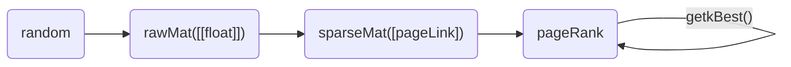

# PageRank

## 类型定义

```go
type rawMat struct{
    mat [][]float
}

type pageLink struct{
    src int
    deg int
    dests []int
}

type blockPageLink struct{
    pageLinks []pageLink
}

type sparseMat struct{
    pageLinks []blockPageLink
}

type pageRank struct{
    transferMat sparseMat
    oldRank []float
    newRank []float
}
```



## 数据生成

在实际生成数据时，不适用rawMat，而是直接在sparseMat中一边生成列数据，一边转成pageLink，否则巨大的rawMat会导致OOM，即使我们有足够的内存，我们在遍历rawMat生成sparseMat的时候，也会需要至少N^2的遍历次数，极其缓慢

一种朴素的想法是首先生成原始的未分块的sparseMat，然后将其转换成分块的sparseMat，这需要至少N^2*outDegree/block(?存疑)的遍历次数（这里block指一个block所含的page数),在实践上,这很慢

目前我们采用直接生成分块的sparseMat,速度上大幅提升

## 超参数
```toml
norm = metric.metric.get1Norm
beta = 0.8
N = 100000
rankBlock = 2
tranMatBlock = 2
epsilon = 0.01
topK = 10
```
## 幂迭代
基于`block-strip`的幂迭代算法:  
```python
sparseMat = sparseMatGen.sparseMat(N, block)
pr = powerIter.pageRank(sparseMat, beta, block)
```  
基于block-based的幂迭代算法
```python
sparseMat = sparseMatGen.sparseMat(N, 1)
pr = powerIter.pageRank(sparseMat, beta, block)
```
不分块的幂迭代算法
```python
sparseMat = sparseMatGen.sparseMat(N, 1)
pr = powerIter.pageRank(sparseMat, beta, 1)
```
> 在实践中,只有block-strip的算法能较快的跑出来


基于block-strip的测试代码:
```python
sparseMat = sparseMatGen.sparseMat(N, tranMatBlock)
pr = powerIter.pageRank(sparseMat, beta, rankBlock)

cnt = 0
loss = 0.
beg = time.time()

while (True):
    cnt += 1
    # use rankBlock to iter, if rankBlock != tranMatBlock, it should be a block-based powerIter
    pr.iter(rankBlock)
    ok, loss = pr.isConvergence(epsilon, norm)
    print(f"\033[1;36miter:{cnt} loss:{loss}\033[0m")
    if ok:
        break

end = time.time()
```

```sh
method:block-strip norm:get1Norm epsilon:0.01 beta:0.8
N:100000 rankBlock:2 transferMatBlock:2 topK:10

>>Using version: 3      generate blocked/unblocked sparseMat from random
[Time] function GenBlockPageLinks               done, elapsed: 11.380315780639648s
[Time] function iterBlock                       done, elapsed: 1.5324246883392334s
[Time] function iter                            done, elapsed: 1.5324790477752686s
[Time] function isConvergence                   done, elapsed: 0.023917198181152344s
iter:1 loss:0.20541711253191414
[Time] function iterBlock                       done, elapsed: 1.5140271186828613s
[Time] function iter                            done, elapsed: 1.5140271186828613s
[Time] function isConvergence                   done, elapsed: 0.037732601165771484s
iter:2 loss:0.051956837022985404
[Time] function iterBlock                       done, elapsed: 1.4992117881774902s
[Time] function iter                            done, elapsed: 1.4992117881774902s
[Time] function isConvergence                   done, elapsed: 0.040131568908691406s
iter:3 loss:0.01331376224195206
[Time] function iterBlock                       done, elapsed: 1.5105924606323242s
[Time] function iter                            done, elapsed: 1.5105924606323242s
[Time] function isConvergence                   done, elapsed: 0.038841962814331055s
iter:4 loss:0.0034044184233290487
[done] iter:4 , loss=0.0034044184233290487 , time:6.200764417648315s 
[Time] function getkBest                        done, elapsed: 0.020008563995361328s
=*=*=*=*=*=*=*=*=*=*=*=*=*=*=*=*=*=*=*=*
method:block-strip norm:get1Norm epsilon:0.01 beta:0.8
N:100000 rankBlock:2 transferMatBlock:2 topK:10
=*=*=*=*=*=*=*=*=*=*=*=*=*=*=*=*=*=*=*=*
topK:10 [{45545,2.316647131960007e-05}, {87035,2.3057621766561018e-05}, {23290,2.2491626018793358e-05}, {8112,2.234915791275326e-05}, {84458,2.2231686800637305e-05}, {41871,2.2087394246452247e-05}, {46410,2.202682727085905e-05}, {73630,2.189704093956144e-05}, {94730,2.1877865475172602e-05}, {3218,2.1826694924946933e-05}]
[Time] function pageRankFromRandom              done, elapsed: 18.633790254592896s
```

## 耗时
程序的耗时主要在生成分块的稀疏矩阵上,  
当N=100K,block=2时,生成分块稀疏矩阵的时间为11s左右,而迭代时间仅为1.4s左右  
当N=100K,block=10时,生成分块稀疏矩阵的时间为31s左右,而迭代时间仅为1.4s左右  
当N=100K,block=100时,生成分块稀疏矩阵的时间为292s左右,而迭代时间仅为1.4s左右  
当N=100K,block=1000时,生成分块稀疏矩阵的时间为2815s左右,而迭代时间仅为1.4s左右

当使用二范数时,程序迭代次数一般为1,
当使用一范数时,程序迭代次数显著增加

## 序列化

在分块的设计中，我们应该一次从文件中读取一块，目前用内存模拟,一次读取内存的一块

在序列化设计中，要考虑block是不定长的，dests是不定长的，这两个都要在前面加长度字段

## Metric

集成了常见的三种范数

```python
class metric(object):
    @staticmethod
    def get1Norm(a: []):
        return sum(map(abs, a))

    @staticmethod
    def get2Norm(a: []):
        return math.sqrt(sum(map(lambda x: x**2, a)))

    @staticmethod
    def getInfNorm(a: []):
        return max(map(abs, a))
```

## TopK problem
题目要求输出 PageRank值最大的10个网页的编号与对应PageRank值,这是典型的topk问题,我们使用一个简单的小顶堆完成近似O(NlogK)的检索

