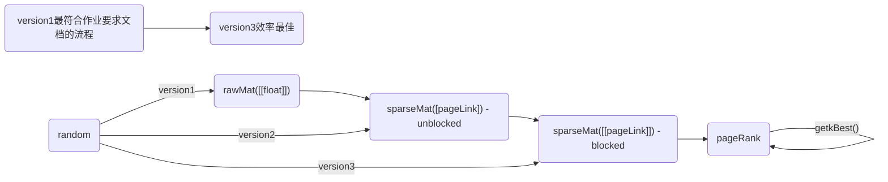

# PageRank

## 类型定义

```go
type rawMat struct{
    mat [][]float
}

type pageLink struct{
    src int
    deg int
    dests []int
}

type blockPageLink struct{
    pageLinks []pageLink
}

type sparseMat struct{
    pageLinks []blockPageLink
}

type pageRank struct{
    transferMat sparseMat
    oldRank []float
    newRank []float
}
```



## 数据生成

在实际生成数据时，不适用rawMat，而是直接在sparseMat中一边生成列数据，一边转成pageLink，否则巨大的rawMat会导致OOM，即使我们有足够的内存，我们在遍历rawMat生成sparseMat的时候，也会需要至少N^2的遍历次数，极其缓慢

一种朴素的想法是首先生成原始的未分块的sparseMat，然后将其转换成分块的sparseMat，这需要至少N^2*outDegree/block(?存疑)的遍历次数（这里block指一个block所含的page数),在实践上,这很慢

目前我们采用直接生成分块的sparseMat,速度上大幅提升

## 超参数
```toml
norm = metric.metric.get1Norm
beta = 0.8
N = 100000
rankBlock = 2
tranMatBlock = 2
epsilon = 0.01
topK = 10
```
## 幂迭代
基于`block-strip`的幂迭代算法:  
> 似乎block=2时,迭代最快
```python
sparseMat = sparseMatGen.sparseMat(N, block)
pr = powerIter.pageRank(sparseMat, beta, block)
```
基于block-based的幂迭代算法
> rankBlock越大,迭代越快
```python
sparseMat = sparseMatGen.sparseMat(N, 1)
pr = powerIter.pageRank(sparseMat, beta, block)
```
不分块的幂迭代算法
```python
sparseMat = sparseMatGen.sparseMat(N, 1)
pr = powerIter.pageRank(sparseMat, beta, 1)
```
> 在实践中,只有block-strip的算法能较快的跑出来


基于block-strip的测试代码:
```python
sparseMat = sparseMatGen.sparseMat(N, tranMatBlock)
pr = powerIter.pageRank(sparseMat, beta, rankBlock)

cnt = 0
loss = 0.
beg = time.time()

while (True):
    cnt += 1
    # use rankBlock to iter, if rankBlock != tranMatBlock, it should be a block-based powerIter
    pr.iter(rankBlock)
    ok, loss = pr.isConvergence(epsilon, norm)
    print(f"\033[1;36miter:{cnt} loss:{loss}\033[0m")
    if ok:
        break

end = time.time()
```

```sh
~x~ ~x~ ~x~ ~x~ ~x~ ~x~ ~x~ ~x~ ~x~ ~x~ 
method:block-strip norm:get1Norm epsilon:0.01 beta:0.8
N:100000 rankBlock:2 transferMatBlock:2 topK:10
in-memory mock: mat:False rank:False
~x~ ~x~ ~x~ ~x~ ~x~ ~x~ ~x~ ~x~ ~x~ ~x~
>>Using version: 3      generate blocked/unblocked sparseMat from random
[Time] function GenBlockPageLinks               done, elapsed: 11.661165952682495s
<<
[Time] function iterBlock                       done, elapsed: 3.9188873767852783s
[Time] function iter                            done, elapsed: 3.9188873767852783s
[Time] function isConvergence                   done, elapsed: 0.20461249351501465s
iter:1 loss:0.20563505192585257
[Time] function iterBlock                       done, elapsed: 3.885291814804077s
[Time] function iter                            done, elapsed: 3.885291814804077s
[Time] function isConvergence                   done, elapsed: 0.2454683780670166s
iter:2 loss:0.052047313284438255
[Time] function iterBlock                       done, elapsed: 3.8893918991088867s
[Time] function iter                            done, elapsed: 3.8893918991088867s
[Time] function isConvergence                   done, elapsed: 0.2427527904510498s
iter:3 loss:0.013432839437036702
[Time] function iterBlock                       done, elapsed: 3.9569618701934814s
[Time] function iter                            done, elapsed: 3.9569618701934814s
[Time] function isConvergence                   done, elapsed: 0.24289679527282715s
iter:4 loss:0.0034638603076756736
[done] iter:4 , loss=0.0034638603076756736 , time:16.588993310928345s 
[Time] function getkBest                        done, elapsed: 0.02480936050415039s
=*=*=*=*=*=*=*=*=*=*=*=*=*=*=*=*=*=*=*=*
method:block-strip norm:get1Norm epsilon:0.01 beta:0.8
N:100000 rankBlock:2 transferMatBlock:2 topK:10
in-memory mock: mat:False rank:False
=*=*=*=*=*=*=*=*=*=*=*=*=*=*=*=*=*=*=*=*
topK:10 [{26864,2.4720211104490707e-05}, {37656,2.3662985169826415e-05}, {56406,2.3624384712678766e-05}, {55737,2.332107861271795e-05}, {67684,2.3236709877288255e-05}, {67265,2.313418510164298e-05}, {9773,2.3051620869655743e-05}, {45052,2.2907097493032435e-05}, {22053,2.2631881530632047e-05}, {75927,2.252217453416674e-05}]
[Time] function pageRankFromRandom              done, elapsed: 32.27410936355591s
```

## 耗时
程序的耗时主要在生成分块的稀疏矩阵上,  
当N=100K,block=2时,生成分块稀疏矩阵的时间为11s左右,而迭代时间仅为1.4s左右  
当N=100K,block=10时,生成分块稀疏矩阵的时间为31s左右,而迭代时间仅为1.4s左右  
当N=100K,block=100时,生成分块稀疏矩阵的时间为292s左右,而迭代时间仅为1.4s左右  
当N=100K,block=1000时,生成分块稀疏矩阵的时间为2815s左右,而迭代时间仅为1.4s左右

当使用二范数时,程序迭代次数一般为1,
当使用一范数时,程序迭代次数显著增加

## 序列化

在分块的设计中,我们需要考虑每一块的长度和每一个pageLink的destinations的长度  
在实践上,我们将一个pageLink存为一行,这样就解决了destinations的不定长问题(即以\n作为分隔符),为了解决块的不定长问题,起初我们采用了每一块一个文件的想法,但实践下来发现,一个文件(一块)仅有20行左右的pageLink,数万个文件的频繁的syscall导致速度较慢,效率太低.  
因此,在最新版的设计中,我们选择将所有的block放在一个文件中,命名为"block",我们新增一个"index"文件,该文件按行存储每个block的长度,这样我们在迭代过程中,我们将文件视作io流,首先读index文件中的下一行取出块大小m,然后读block文件的下m行即可.  
此外在每轮迭代时,我们都应该将文件指针复位(seek(0))


## Metric

集成了常见的三种范数

```python
class metric(object):
    @staticmethod
    def get1Norm(a: []):
        return sum(map(abs, a))

    @staticmethod
    def get2Norm(a: []):
        return math.sqrt(sum(map(lambda x: x**2, a)))

    @staticmethod
    def getInfNorm(a: []):
        return max(map(abs, a))
```

## TopK problem
题目要求输出 PageRank值最大的10个网页的编号与对应PageRank值,这是典型的topk问题,我们使用一个简单的小顶堆完成近似O(NlogK)的检索

